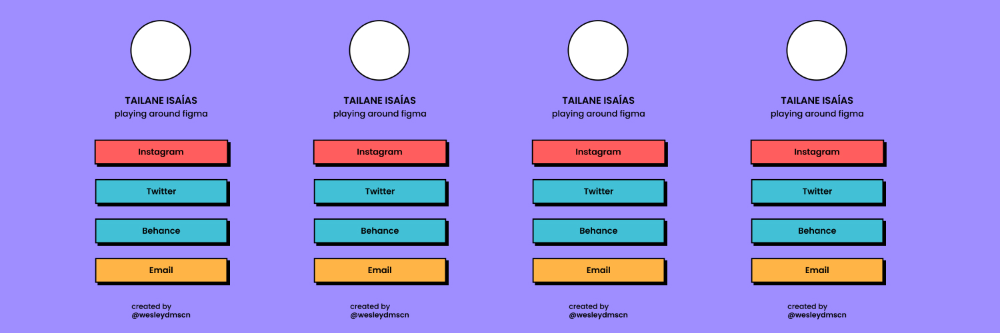

<div align="center">
  <p align="center">A free linktree alternative for a UI Designer. 🌳</p>
  <p align="center">
    <a href="#project">Project</a> · 
    <a href="#how-it-works">How it works?</a> · 
    <a href="#built-with">Built with</a> ·
    <a href="./LICENSE">License</a>
  </p>
</div>

## Project
This project is part of a freelance service consisting of a free linktree alternative for a UI designer [tailaneisaias](https://www.linkedin.com/in/tailaneisaias/).

<div align="center">
  
</div>

## How it works?
This project is easily customizable and made to be easy to add/remove links.
You can easily add or remove links using the `links.js` file, which is a module that exports an array of objects, each link and its information being inside the properties of that object. In that same file there is also a module that exports a constant that is the profile image link.

There are three properties and a constant of type string:
- Properties: 
  - **name**: What is the name that will appear as the title of the link.
  - **url**: A url with the link you want to redirect.
  - **color**: Color, which is currently defined in the .css just three ```red, blue, orange```.
- Constant:
  - **profileImage**: profile image link.

```js
export const profileImage = "./assets/profile_image.jpg";

export const links = [
  {
    name: 'Instagram',
    url: 'https://yourlink.com/',
    color: 'red'
  },
]
```

To customize with your information I recommend making a clone of the project using:
```bash
git clone <repo-url>
```

## Built with
- HTML
- CSS
- JavaScript
